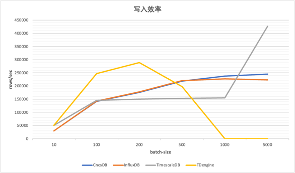
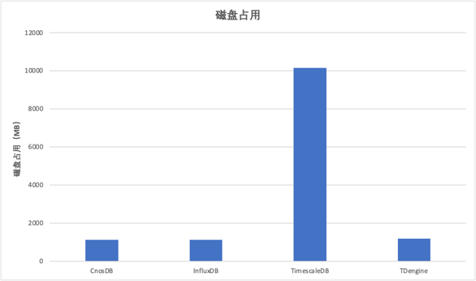

# CnosDB性能比较


## 描述

为了帮助用户快速选型，本文对CnosDB，InfluxDB，TimescaleDB，TDengine等四种不同的时间序列数据库分别在数据写入，磁盘占用和查询效率三个纬度进行比较。
1. 数据写入
2. 磁盘占用
3. 查询效率

测试工具使用[时序数据库专用测试工具](https://github.com/cnosdb/tsdb-comparisons)进行测试

## 运行环境
为了公平起见，均使用统一规格的运行环境进行比较，以下为阿里云上的ECS服务器配置

1. 运行环境
   ```
   ecs.c6e.4xlarge
   16vCPU
   32GiB
   Ubuntu 18.04.6 LTS
   ESSD云盘 400GB  PL1
   ```
   1. 软件版本

   | 数据库             | 版本          |
   |-------------|---------|
   | CnosDB          | v1.0.1 |
   | InfluxDB          | v1.8.10     |
   | TimescaleDB         | v2.6.1-pg14 |
   |  TDengine       | v2.4.0.18   |
## 摘要

CnosDB在每批次为5000的时候写入为245340.98/sec

InfluxDB在每批次为5000的时候写入为223701.85/sec

TimescaleDB在每批次为5000的时候写入为426297.89/sec

TDengine在每批次为200的时候写入为289107.37/sec

测试数据总量为62231779行数据，492052007个值，大小为12G，以8个线程分不同的批次向数据库写入

## 写入效率



## 磁盘占用



## 查询效率

|                                   | CnosDB    | InfluxDB  | TimescaleDB | TDengine    |
|-----------------------------------|-----------|-----------|-------------|-------------|
| last-loc                          | 23.50/sec | 21.72/sec | 861.71/sec  | 2225.86/sec |
| low-fuel                          | 18.84/sec | 11.97/sec | 970.40/sec  | 2608.26/sec |
| high-load                         | 23.37/sec | 16.47/sec | 896.53/sec  | 不支持         |
| stationary-trucks                 | 3.95/sec  | 2.99/sec  | 87.37/sec   | 不支持         |
| long-driving-sessions             | 21.20/sec | 19.54/sec | 2.33/sec    | 不支持         |
| long-daily-sessions               | 4.66/sec  | 4.33/sec  | 0.29/sec    | 不支持         |
| avg-vs-projected-fuel-consumption | 0.62/sec  | 0.47/sec  | 0.79/sec    | 不支持         |
| avg-daily-driving-duration        | 0.69/sec  | 0.60/sec  | 0.29/sec    | 738.69/sec  |
| avg-daily-driving-session         | 0.36/sec  | 0.33/sec  | 0.29/sec    | 不支持         |


